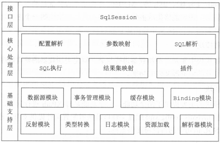
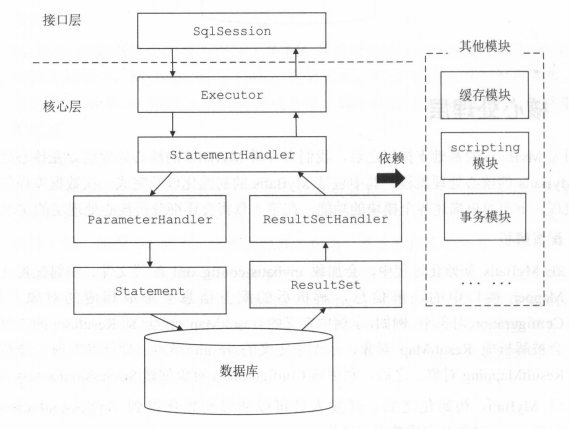

## Mybatis源码学习---概述（day1）

### 1.常用的持久层框架比较

在实际开发 Java 系统时，我们一般通过 JDBC 完成多种数据库操作。其主要步骤如下：

（1）注册数据库驱动，明确数据库 URL 地址、数据库用户名、密码等连接信息 

（2）通过DriverManager打开数据库连接 2 I MyBatis 技术内幕

（3）通过数据库连接创建Statement 对象

（4）通过 Statement 对象执行 SQL 语句，得到 ResultSet 对象

（5）从ResultSet 对象中获取数据，并将数据转换成 JavaBean对象

（6）关闭 ResultSet Statement 对象以及数据库连接，释放相关资源

总体看来、除了第四步和第五步不一样之外、其他的操作都是重复的。而且还要对对象和数据库字段之间进行频繁转换。这种频繁的数据库连接和销毁也十分的耗性能。所以就有了持久化层面上的各种框架、目的是屏蔽底层操作、优化性能、提高开发效率等。

**Spring JDBC**： Spring JDBC  并不能算是一个 ORM（ Object Relational Mapping ）对象关系映射框架， 仅仅是使用模板方式对原生 JDBC 进行了一层非常薄的封装，它可以帮助开发人员屏蔽创建数据库连接对、Statement 对象、异常处理以及事务管理的重复性代码，提高开发效率。 

**Hibernate**:曾经最火热的ORM重量级框架，但并不是数据库中所有 的概念都能在面向对象的世界中找到合适的映射，例如，索引、存储过程、函数等， 在有些大数据量、高并发、低延迟的场景下， Hibernate 并不是特别适合。此外Hibernate 对批处理和SQL优化的支持并不是很友好。主要是性能瓶颈让它慢慢的淡出了历史舞台

**JPA**： Java Persistence API  JPA )是EJB3.0 中持久化部分的规范，但它可以脱离 EJB 的体系单独作为一个持久化规范进行使用，但是并没有得到很好的发展，现在在实践中的出场率也不是很高 

**Mybatis**：是一个轻量级，高可控性的半自动化持久层框架，屏蔽了底层基础操作的同时也给了开发人员定制化的入口，使用 MyBatis 时我们直接在映射配置文件中编写待执行的原生 SQL 语句，这就给了我们直接优化 SQL 语句的机会，让 SQL 语句选择合适的索引，能更好地提高系统的性能，更加适合大数据量、高并发等场景 

``PS:大数据时代、性能决定产品的导向和存亡``

### 2.Mybatis架构组成

**SqlSession**： 该接口中定义了 MyBatis 暴露给应用程序调用的API ，也就是上层应用与 MyBatis 交互的桥梁。接口层在接收到调用请求时，会调用核心处理层的相应模块来完成具体的数据库操作

**配置解析**:对各种配置文件 mybatis-config.xml 、mapper、注解等解析后保存到 Configuration 对象 。初始化SqlSession对象

**参数映射，结果映射，SQL解析，SQL执行**： SQL 语句的执行涉及多个组件 ，其中比较重要的是 Executor StatementHandler ParameterHandler ResultSetHandler executor 主要负责维护一级缓存和二级缓存， 并提供事务管理的相关操作 ，它会将数据库相关操作委托给 StatementHandler 完成。 StatementHandler 首先通过 ParameterHandler 完成 SQL 语句的实参绑定，然后通过 java.sql.Statement 象执行 SQL 语句并得到结果集，最后通过 ResultSetHandler 完成结果集的映射，得到结果对象并返回 

**其他插件**: MyBatis 提供了插件接口，我们可以通过添加用户自定义插件的方式对 MyBatis 进行扩展 

### 3.学习计划

按照架构图的结构，由下至上、循序渐进学习

| 编号 | 内容                           |
| ---- | ------------------------------ |
| 1    | XML解析                        |
| 2    | 反射工具箱                     |
| 3    | 类型转换                       |
| 4    | 日志模块                       |
| 5    | 资源加载                       |
| 6    | 数据源（DataSource）           |
| 7    | 事务（transaction）            |
| 8    | 绑定模块（binding）            |
| 9    | 缓存模块（cache）              |
| 10   | 基础模块总结                   |
| 11   | mybatis初始化（配置解析）      |
| 12   | SQL解析（SqlNode&SqlSource）   |
| 13   | 结果集映射（ResultSetHandler） |
| 14   | ID生产器（KeyGenerator）       |
| 15   | SQL执行（StatementHandler）    |
| 16   | SQL执行（Executor）            |
| 17   | 接口设计（SqlSession）         |
| 18   | 插件                           |
| 19   | 与spring整合                   |
| 20   | 附属知识点                     |
| 21   | 核心模块总结                   |

### 4.学习方法

- 1.提前预习通读一遍，整理出核心知识点和问题
- 2.详细阅读教程一遍、再次思考知识点并解答和提出问题
- 3.结合源码查看整体的结构、个体的方法和变量、具体的方法过程、并在源码上做笔记
- 4.总结并解答提出的问题、纪录笔记保存复习